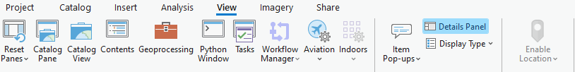
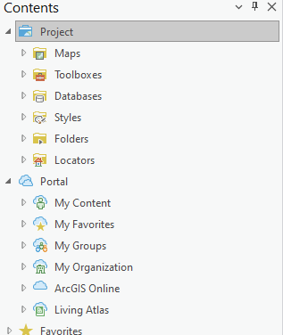
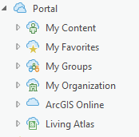
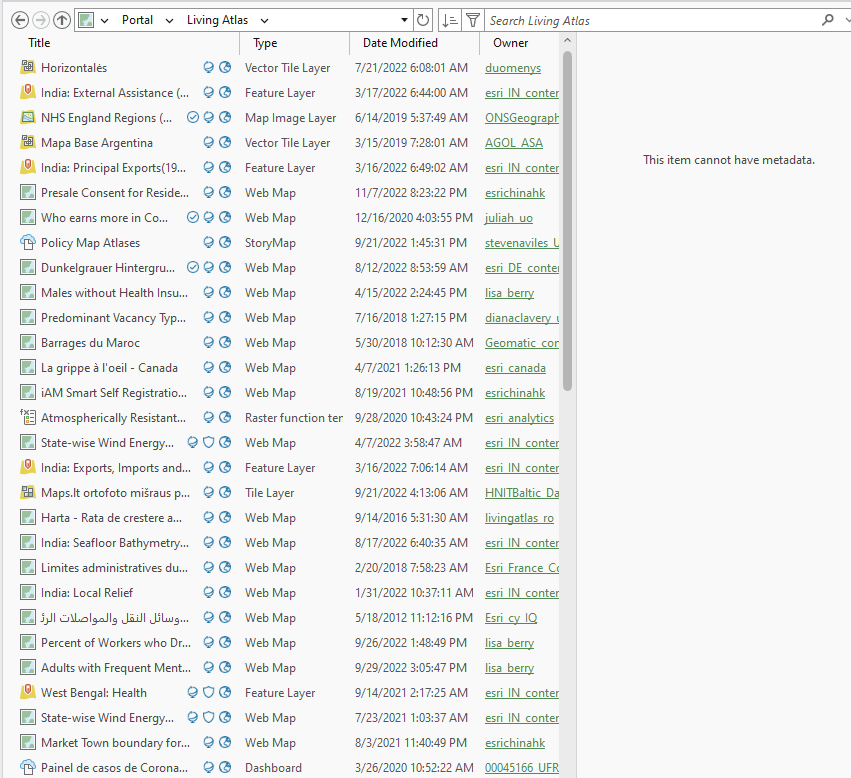
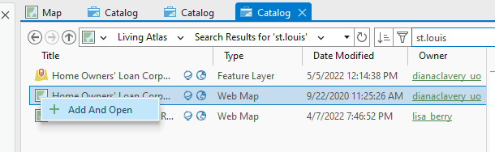
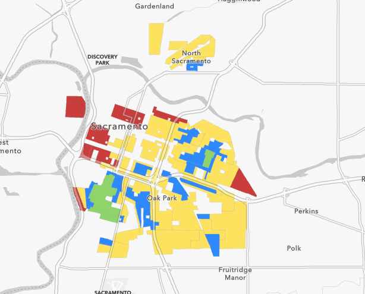
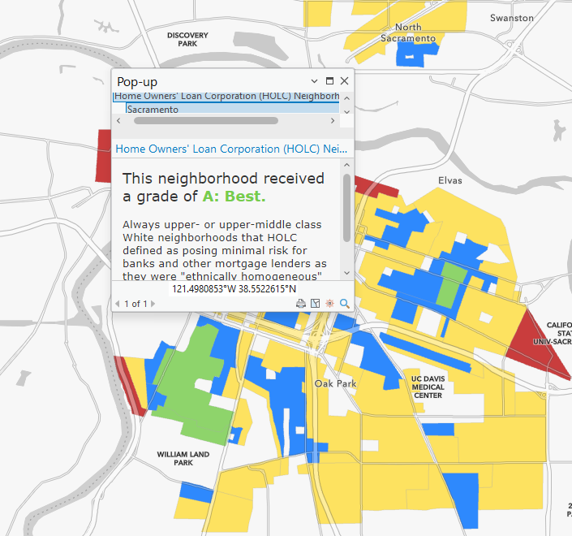

# Part 2 - Loading map data from Living Atlas to your project
## The Living Atlas is a collection of different maps and layer assets that you can import into your own project.  These different assets have been uploaded by other users free to use

### Step 1.
To get started on this click on the view tab on the top toolbar. Click on the Catalog pane. After
that on the side bar will appear and here you can find the portal tab. Under this tab you will find
many different items. Find the item Living Atas.

### Step 2.
Click on the living Atlas Tab\

### Step 3.
Once you click on the Living Atlas Tab, you will find a search box and a filter. The filter lets you
select any filters you need in order for you to find what kind of data you are looking for easier.

### Step 4.
When you click on the Living Atlas Tab you will also find a long list of possible map data that you
can add to your project. The are all listed under a tab called Catalog
### Step 5.
Select any of the maps you want to add by right clicking on it and selecting add and open

### Step 6.
Once you have done that the map that you selected will open up and you will be able to scroll
through it.

### Step 7.
Click through parts of the map and there will be a pop up that will show the data of a certain part
of the map.

