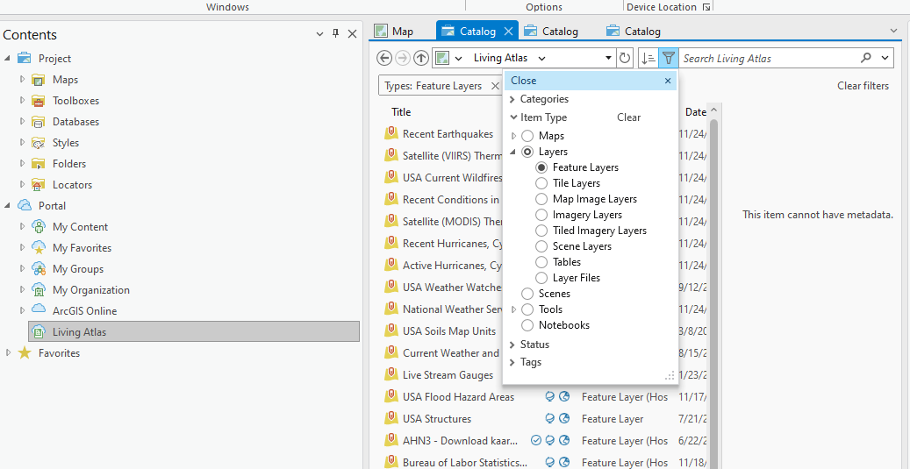
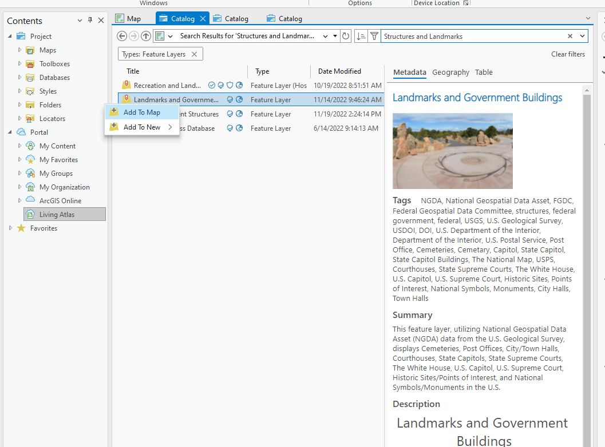
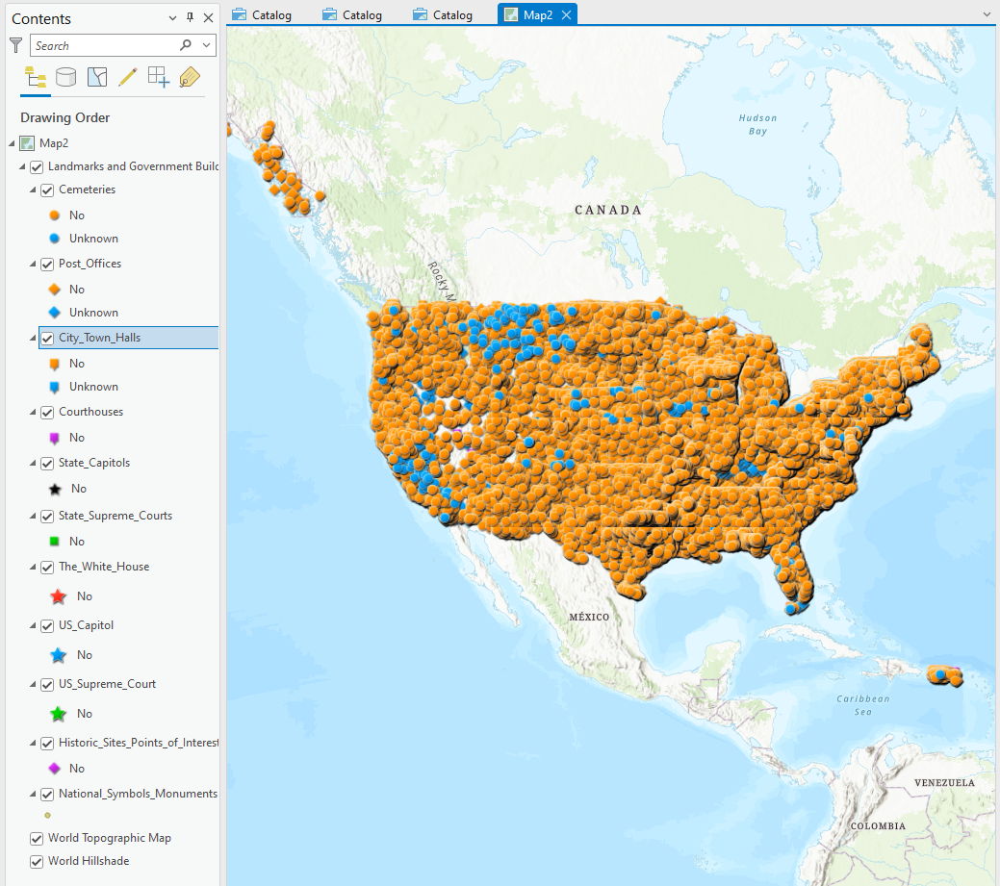
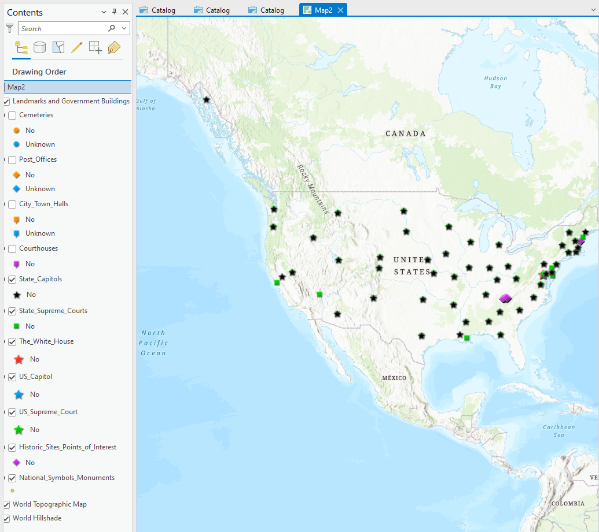

# Part 3 - Feature Layers: 
### Feature layers are layers that are used to group many similar features of a map. They can be good for organizing and grouping similar points together. Let's say you want to see all of the famous National Parks all grouped together or to see all of the Walmarts or Starbucks in one layer. You can load in multiple layers and turn them on and off to compare against each other. Let's get started on importing a feature layer.

### Step 1.
Similarly to what we did in part 2, we can find many different feature layers to import into our
own map project by finding it in the Living Atlas. So head over the Living Atlas before and now
let's change our filters to feature layers. The feature layer filter can be found under item type
and then layers:

### Step 2:
Here once we get the search to filter only feature layers, you can search many different feature
layers that pertain to many different topics. You can go ahead and scroll through and see the
different layers and add whichever one you are interested in into your map. However in this
tutorial we will be using Landmarks and Government Buildings feature layer. Go ahead and add
the feature layer to your map

### Step 3:
Once you have added the feature layer into your map once you will see that your map will be
fully populated to many different dots. All of these dots represent the many different landmarks
and buildings. We can see the different categories on the right panel. Though the map is so
populated with so many different dots that it looks so messy and chaotic it is hard to work with
the map so lets untick the cemeteries, post office, courthouses, and city town halls landmarks in
the panel located on the right. Now it's much easier to look at.

### Step 4:
Now that we have the different dots representing the different landmarks, we can click on them
to get more information. The information that we get from clicking on the data points for example
in the image gives us the name of the data point, the address, and its feature type.

